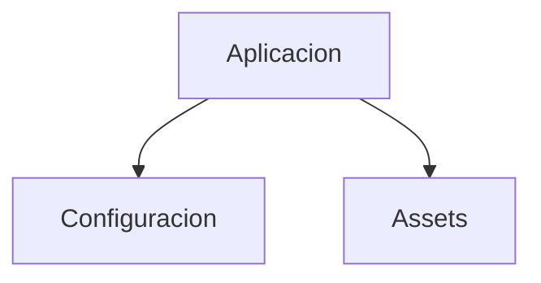

# g360-stock-api

<picture>
  <source media="(prefers-color-scheme: dark)" srcset="logotypes/logo-g360-light.svg">
  
</picture>

> Proyecto g360-stock-api

[](https://github.com)

## ¿Cómo está organizado el proyecto?



## Quick Start

```bash
# 1. Entrar al proyecto
cd g360-stock-api

# 2. Ver estructura
g360 present

# 3. Auditar compliance
g360 audit

# 4. Traer assets de marca
g360 bring brand
```

## Identidad de Marca

| Elemento | Valor |
|---|---|
| Marca | G360 |
| Color primario | #00d084 |
| Signature mode | powered |
| Signature text | "powered by G360" |
| Logo | logotypes/logo-g360-dark.svg |

## Footer

```html
<g360-signature mode="powered"></g360-signature>
```

---

**Marca**: G360 · **Isotipo**: 3 puntos + chevron `>`
**Signature**: powered by G360 · **Powered by**: [g360-signature](https://github.com/carloscus/g360-signature)

*Generado por `g360 docs` · Fuente: `brand.json` + `skill.json` + `g360-manifest.json`*
