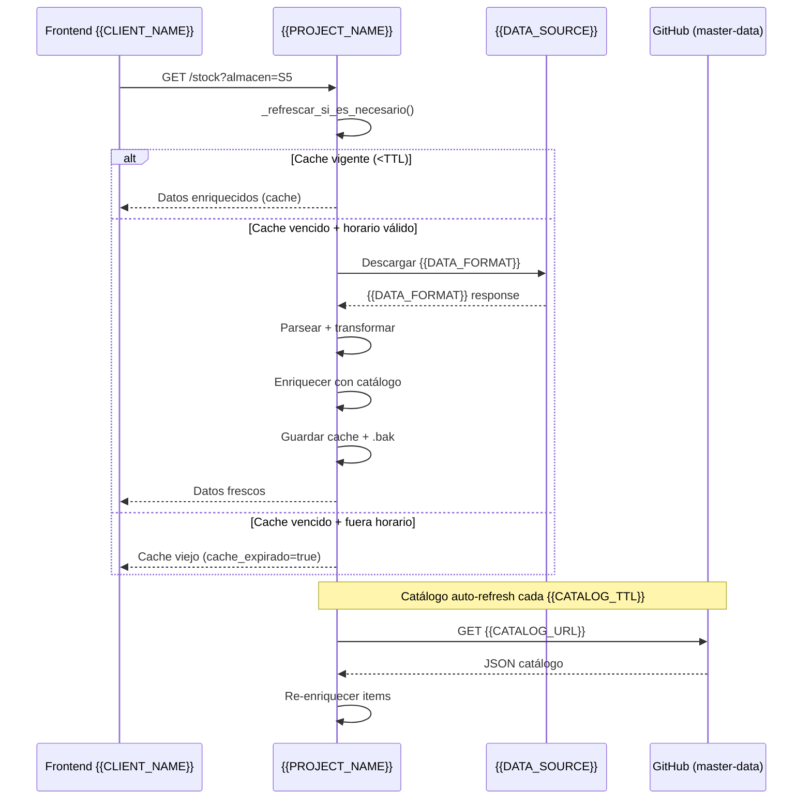

# {{PROJECT_NAME}}

<picture>
  <source media="(prefers-color-scheme: dark)" srcset="logotypes/logo-g360-light.svg">
  
</picture>

> {{PROJECT_DESCRIPTION}}

[](https://github.com)
[](https://github.com/carloscus/g360-cli)
[](https://www.python.org/)

## ¿Cómo está organizado el proyecto?

```mermaid
flowchart TD
    SOURCE["{{DATA_SOURCE}}<br/>{{DATA_FORMAT}}"]
    MASTER["g360-master-data<br/>{{MASTER_DATA_FILE}}"]

    subgraph API["{{PROJECT_NAME}}"]
        CACHE1["{{CACHE_FILE_1}}"]
        CACHE2["{{CACHE_FILE_2}}"]
        CAT_CACHE["{{CAT_CACHE_FILE}}<br/>({{CAT_SKUS}} SKUs)"]
        ENRICH["enriquecimiento<br/>(al cachear, no por request)"]
        MERGE["_merge_items_por_sku<br/>(sin duplicados)"]
    end

    SOURCE -->|{{SOURCE_PARAM}}| CACHE1
    SOURCE -->|{{SOURCE_PARAM_2}}| CACHE2
    MASTER -->|auto-download| CAT_CACHE
    CACHE1 & CACHE2 --> ENRICH
    CAT_CACHE --> ENRICH
    ENRICH --> MERGE

    subgraph ENDPOINTS["Endpoints REST"]
        STOCK["GET /api/v1/stock"]
        SKU["GET /api/v1/stock/{sku}"]
        ALM["GET /api/v1/almacenes"]
        RESUMEN["GET /api/v1/resumen"]
    end

    MERGE --> STOCK
    MERGE --> SKU
    CACHE1 & CACHE2 --> ALM
    CACHE1 --> RESUMEN
```

## Tabla de Contenidos

- [Descripción](#descripción)
- [Arquitectura](#arquitectura)
- [Endpoints](#endpoints)
- [Guía rápida](#guía-rápida)
- [Protecciones](#protecciones)
- [Tipos de almacén](#tipos-de-almacén)
- [Fuentes de datos](#fuentes-de-datos)
- [Catálogo maestro](#catálogo-maestro)
- [Cache](#cache)
- [Configuración](#configuración)
- [Desarrollo](#desarrollo)
- [Deploy](#deploy)
- [Ecosistema G360](#ecosistema-g360)

---

## Descripción

{{PROJECT_DESCRIPTION_LONG}}

**Tipo**: {{PROJECT_TYPE}}  
**Runtime**: {{RUNTIME}}  
**Uso**: {{TARGET_AUDIENCE}}

---

## Arquitectura



---

## Endpoints

| Método | Ruta | Descripción |
|--------|------|-------------|
| `GET` | `/api/v1/health` | Estado del servicio y cache |
| `GET` | `/api/v1/stock` | Listar stock completo con filtros (enriquecido) |
| `GET` | `/api/v1/stock/{sku}` | Detalle de un SKU con desglose por almacén |
| `GET` | `/api/v1/almacenes` | Lista de almacenes disponibles |
| `GET` | `/api/v1/lineas` | Lista de líneas de producto |
| `GET` | `/api/v1/categorias` | Categorías de negocio con líneas |
| `GET` | `/api/v1/resumen` | Resumen y KPIs del stock |
| `POST` | `/api/v1/upload/stock` | Subir archivo {{DATA_FORMAT}} manualmente |
| `POST` | `/api/v1/upload/catalog` | Subir catálogo maestro JSON |
| `GET` | `/api/v1/catalog` | Lista del catálogo maestro (sin stock) |
| `GET` | `/api/v1/catalog/health` | Estado del catálogo cargado |

---

## Guía rápida

### Auto-detección inteligente

```
GET /api/v1/stock?almacen=S5     → fuente=todas automáticamente
GET /api/v1/stock/77145          → mergea almacenes si existe en sucursales
GET /api/v1/stock?linea=ARCHIVO  → busca "02 - ARCHIVO" o "ARCHIVO"
```

### Ejemplos típicos

```bash
# Ver todos los SKUs en VES
GET /api/v1/stock?almacen=VES&limit=20

# Sucursales con stock de una categoría
GET /api/v1/stock?fuente=sucursales&categoria=VINIFAN

# Marketing + sucursales combinados
GET /api/v1/stock?tipo=mktd

# Detalle completo de SKU
GET /api/v1/stock/011019?fuente=todas

# Resumen ejecutivo
GET /api/v1/resumen
```

---

## Protecciones

| Capa | Qué hace | Qué previene |
|------|----------|--------------|
| **Rate limiting** | 60 req/min por IP | Saturación, abuso |
| **Request timeout** | 30s max, devuelve 504 | Requests colgados |
| **Circuit breaker** | 3 fallos → pausa 5 min | Caída en cascada |
| **Cache stale** | Sirve datos viejos si fuente cae | Respuestas vacías |
| **{{DATA_FORMAT}} size limit** | 5MB max por descarga | Memoria agotada |
| **Thread-safe lock** | 1 descarga por fuente a la vez | Duplicados |
| **CORS** | Orígenes configurables | Acceso no autorizado |
| **API Key** | Header X-API-Key requerido | Acceso sin auth |
| **GZip** | Compresión automática >500 bytes | Ancho de banda |
| **Request logging** | method, path, status, elapsed, IP | Trazabilidad |

---

## Tipos de almacén

| Tipo | Almacenes |
|------|-----------|
| `venta` | {{VENTA_ALMACENES}} |
| `mktd` | {{MKTD_ALMACENES}} |

---

## Fuentes de datos

| Fuente | URL {{DATA_SOURCE}} | Almacenes | Cache |
|--------|---------------------|-----------|-------|
| `general` | `{{PARAM_1}}=""` | {{GENERAL_ALMACENES}} | `{{CACHE_1}}` |
| `sucursales` | `{{PARAM_2}}="1"` | {{SUCURSAL_ALMACENES}} | `{{CACHE_2}}` |
| `todas` | ambas | ambos, mergeados por SKU sin duplicados | ambas |

---

## Catálogo maestro

Cargado desde `g360-master-data` (JSON en GitHub):
- **`/api/v1/upload/catalog`** — subir archivo JSON manualmente
- **Auto-carga** — al iniciar, si no hay catálogo en disco, descarga desde GitHub
- **Auto-refresh** — cuando TTL expira (6h), refresca automáticamente
- **TTL** — 6 horas (21600s)

Campos usados: `sku`, `linea`, `grupo`, `tipo`, `familia`, `categoria`, `ean13`, `ean14`, `un_bx`, `peso_kg`, `precio`, `keywords`, `nombre_corto`

---

## Cache

Archivos en `data/`:
- `{{CACHE_1}}` — fuente general
- `{{CACHE_2}}` — fuente sucursales
- `{{CAT_CACHE}}` — catálogo maestro

Backup rotativo (`.bak`) si el principal se corrompe. Los items se enriquecen **al cachear**, no por request.

### Reglas de refresco

1. **Sin cache** → descarga forzada (sin importar día/hora)
2. **Cache vigente** (< TTL) → sirve directo
3. **Cache vencido + horario válido** (L-S 7:00–22:59 Lima) → descarga fresh
4. **Cache vencido + fuera de horario** → sirve cache vencido (`cache_expirado=true`)
5. **Descarga falla + hay cache** → sirve cache vencido, reintenta en ~15 min

---

## Configuración

Variables de entorno (prefix `S1_`):

### Fuentes de datos

| Variable | Default | Descripción |
|----------|---------|-------------|
| `S1_SOURCE1_URL` | URL {{DATA_SOURCE}} | Fuente general |
| `S1_SOURCE2_URL` | URL {{DATA_SOURCE}} | Fuente sucursales |
| `S1_CACHE_TTL_SEGUNDOS` | `900` | TTL del cache de stock (15 min) |
| `S1_CACHE_RUTA` | `{{CACHE_1}}` | Cache general |
| `S1_CACHE_RUTA2` | `{{CACHE_2}}` | Cache sucursales |
| `S1_CATALOGO_RUTA` | `{{CAT_CACHE}}` | Cache catálogo |
| `S1_CATALOGO_TTL_SEGUNDOS` | `21600` | TTL del catálogo (6 horas) |
| `S1_CATALOGO_RAW_URL` | URL GitHub | Fuente remota del catálogo |
| `S1_PUERTO` | `8000` | Puerto del servidor |

### Seguridad y protecciones

| Variable | Default | Descripción |
|----------|---------|-------------|
| `S1_API_KEY` | `""` | API Key administrativa. **Setear en {{DEPLOY_PLATFORM}}** |
| `S1_READ_API_KEY` | `""` | API Key de lectura para frontend |
| `S1_RATE_LIMIT` | `60/minute` | Rate limiting por IP |
| `S1_REQUEST_TIMEOUT` | `30` | Timeout en segundos |
| `S1_CORS_ORIGINS` | `*` | Orígenes CORS permitidos |
| `S1_CIRCUIT_BREAKER_MAX_FALLOS` | `3` | Fallos antes de abrir circuito |
| `S1_CIRCUIT_BREAKER_RESET_SEG` | `300` | Segundos para resetear circuito |
| `S1_XLS_MAX_BYTES` | `5242880` | Máximo tamaño de {{DATA_FORMAT}} (5 MB) |

---

## Desarrollo

```bash
pip install -r requirements.txt
uvicorn app.main:app --reload --port 8000
```

Documentación interactiva en `http://localhost:8000/docs`.

### Tests

```bash
pytest tests/ -v
```

---

## Deploy en {{DEPLOY_PLATFORM}}

El repositorio incluye `stock_{{CLIENT_SLUG}}.yaml` (Blueprints). Pasos:

1. Crear repositorio en GitHub y subir el proyecto
2. {{DEPLOY_PLATFORM}} Dashboard → New → Blueprint → seleccionar repositorio
3. {{DEPLOY_PLATFORM}} detecta `stock_{{CLIENT_SLUG}}.yaml` y configura automáticamente
4. Configurar variables de entorno en {{DEPLOY_PLATFORM}} Dashboard:
   - `S1_API_KEY` → clave administrativa
   - `S1_READ_API_KEY` → clave de lectura (frontend)
   - `S1_CORS_ORIGINS` → dominios permitidos

---

## Ecosistema G360

Este proyecto forma parte del ecosistema **G360** para apoyo CRM y gestión de datos en {{CLIENT_NAME}}.

### Herramientas relacionadas

- **[g360-cli](https://github.com/carloscus/g360-cli)** — CLI para inicializar proyectos G360
- **[g360-master-data](https://github.com/carloscus/g360-master-data)** — Catálogo maestro de productos
- **[g360-stock-reporter-lit](https://github.com/carloscus/g360-stock-reporter-lit)** — Frontend PWA
- **[g360-erp-stock-monitor](https://github.com/carloscus/g360-erp-stock-monitor)** — Monitor de stock en tiempo real

---

## Licencia

Proyecto interno del ecosistema **G360 - {{CLIENT_NAME}}**.

---

**Marca**: G360 · Microherramientas para apoyo CRM y datos en {{CLIENT_NAME}}  
**Isotipo**: 3 puntos verticales paralelos (gris-verde-gris) + chevron `>`  
**Signature**: G360 by ccusi  
**Powered by**: [g360-signature](https://github.com/carloscus/g360-signature)

> Identidad generada desde `src/assets/brand/brand.json` (Brand System v2.0.0).  
> El logo arriba usa `<picture>` con `prefers-color-scheme` para light/dark.
